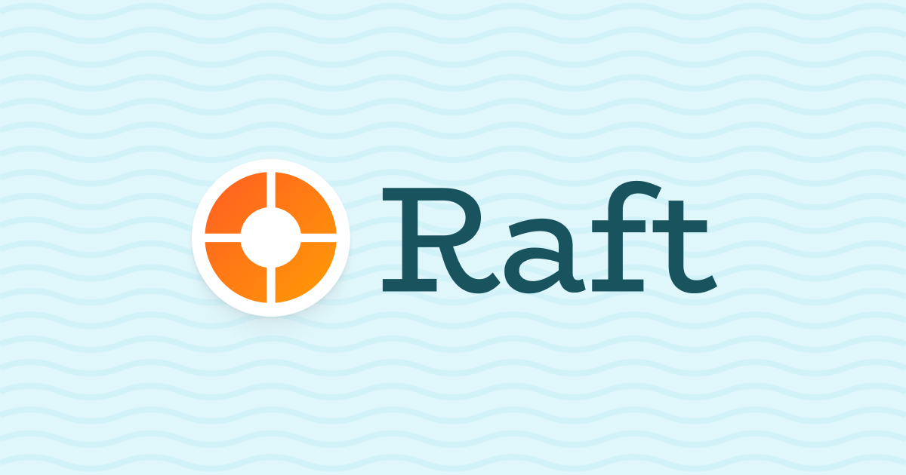

<table>
    <tr><th></th><th></th></tr>
    <tr>
        <td></td>
        <td> 
            <h1>Raft Finance</h1>
            <h3>Updates to v1.0</h3>
            <p>Prepared by: curiousapple, Independent Security Researcher</p>
            <p>Duration: 2 days, May 22 to May 23, 2023</p>
        </td>
    </tr>
</table>

# About 

### [Raft Finance](https://raft.fi/)
In their own words, "Raft is a governance-minimized, decentralized protocol that allows people to generate R (a USD stablecoin) by depositing capital-efficient collateral." </br>
Initially, this capital-efficient collateral was only `wstETH`. Then, Raft Team was looking to accept other tokens such as `rETH` and `WETH` as collateral, but they wanted to implement a cap on the total supply and maximum balance on the position. </br>
The currently deployed contracts don't allow for this to be achieved, as they lack any consideration for supply and maximum balance per collateral token. Consequently, without altering the already deployed contracts, they developed a wrapped collateral token contract. This essentially acts as a wrapper around the underlying assets, enforcing limits on deposits. </br>
In addition, new oracles were integrated to support the recent inclusions, and the existing ones were refactored. </br>
This update also saw the liquidation protocol fee reduced to zero.</br> 
This audit includes the security review for these updates.</br>

### **curiousapple** 🦇

'curiousapple' is an independent smart contract security researcher. 
Previously, he served as a lead smart contract auditor at [Macro](https://0xmacro.com/) and is currently working independently.</br>
His auditing experience covers diverse set of protocols, including DeFi, Bridges, NFTs, DAOs, and Games, in all of which he has discovered severe bugs. </br>
You can find his previous work and contact [here](https://github.com/0xcuriousapple/curiousapple-audits/blob/231caa00d7f0ba8b016b4980b300e6a2fcd93815/README.md) </br>


# Summary & Scope

The scope of the audit included changes made to contracts from `v1.0` tag to commit `d5ca8febd9b7f33e1a3ad1eff1f2ae1d9dcd5b5f` </br>

**Difference:** [raft-fi/contracts/compare/v1.0...d5ca8feb](https://github.com/raft-fi/contracts/compare/v1.0...d5ca8febd9b7f33e1a3ad1eff1f2ae1d9dcd5b5f)


The following contracts were in scope:
- BasePriceOracle.sol
- ChainlinkPriceOracle.sol
- ChainlinkPriceOracleRETH.sol
- ChainlinkPriceOracleWstETH.sol
- TellorPriceOracle.sol
- TellorPriceOracleWstETH.sol
- PositionManager.sol
- PositionManagerStETH.sol
- PositionManagerWETH.sol
- PositionManagerWrappedCollateralToken.sol
- SpiltLiquidationCollateral.sol
- WrappedCollateralToken.sol

# Summary of Findings

| ID     | Title                        | Status |
| ----------- | ---------------------------- | ----- |
| H-01 &nbsp;| `maxBalance` Creates Various Issues for All Protocol Actions, Potentially Leading to Denial of Service on Existing Borrower's Position | Fixed |
| Q-01 &nbsp;| SafeERC20 extension not used for `_underlyingCollateralToken` inside `PositionManagerWrappedCollateralToken`  |  Fixed  |
| Q-02 &nbsp;| Check Effects Interaction pattern not followed for `managePositionETH()` | Fixed  |
| Q-03 &nbsp;| Case of `debtChange == type(uint256).max` not accounted for in `managePositionETH()` of PositionManagerStETH | Fixed  |
| G-01 &nbsp;| Redundant check on `collateralToRedeem` | Won't Do  |

# Detailed Findings

## [H-01] `maxBalance` Creates Various Issues for All Protocol Actions, Potentially Leading to Denial of Service on Existing Borrower's Position

### Action: Add Collateral: Positions Could Never Reach the Total Supply Cap
- Impact: High
- Likelihood: High
  
From the perspective of the wrapped token, the position manager is a individual only. Consequently, all potential positions for that wrapped collateral token would be limited by this individual limit, which is significantly smaller compared to what Raft aims to enable.

### Action: Withdraw Collateral: Borrower's Positions Could Be Blocked for Withdrawal or Liquidation
- Impact: High
- Likelihood: High
  
If someone donates some wrapped token to the position manager, the share price for that wrapped token collateral would increase in the next update (`_updateDebtAndCollateralIndex`). Now for all position holders who had opened a position with `maxBalance`, it's impossible to withdraw or get liquidated. Even if no one donates, this will happen eventually due to redeem rebates. Such an event could cause denial of service for borrowers' positions opened close to `maxBalance`.

### Action: Redeem: Redemption Could Be Blocked Temporarily
- Impact: Medium
- Likelihood: High
  
At first, There would be a certain limit you can redeem for one address.</br>
After some time, once the balance becomes > `maxBalance` for the fee recipient, the protocol won't be able to accept redemption fees anymore, blocking all redemptions. Using this, anyone can DOS redemptions temporarily by sending `maxBalance - balanceOf(recipient)` of the wrapped token to `feeRecipient` directly.

### Action: Liquidations: Liquidators Would Need to Switch Their Bot Address with Each Limit Reached
- Impact: Low
- Likelihood: High

Liquidation bots are usually run by only a certain set of people with specific addresses. Now, there would be a limit up to which they can liquidate positions. As per the current state of the code, liquidation bots will need to create new addresses with each reach of the limit, transfer `ETH` there, and then `liquidate`.

### Recommendation
Consider skipping max balance check for all transfers from position manager.

### Status
Fixed By 
https://github.com/raft-fi/contracts/pull/420
https://github.com/raft-fi/contracts/pull/421
https://github.com/raft-fi/contracts/pull/422

Raft Team is enforcing limit solely on deposits with this fix and is using a whitelist for the caller. This caller is intended to be one of Raft's other peripheral contracts, rather than standard user addresses. Further, they have blocked the transfer of wrapped tokens, unless the process is initiated by the position manager.

## [Q-01] `SafeERC20` extension not used for `_underlyingCollateralToken` inside `PositionManagerWrappedCollateralToken` 
[_underlyingCollateralToken.transferFrom(msg.sender, address(this), collateralChange);](https://github.com/raft-fi/contracts/blob/d5ca8febd9b7f33e1a3ad1eff1f2ae1d9dcd5b5f/contracts/PositionManagerWrappedCollateralToken.sol#L67-L68)
[_underlyingCollateralToken.approve(address(wrappedCollateralToken), type(uint256).max);](https://github.com/raft-fi/contracts/blob/d5ca8febd9b7f33e1a3ad1eff1f2ae1d9dcd5b5f/contracts/PositionManagerWrappedCollateralToken.sol#L40-L41)

### Recommendation
If you are planning to use tokens who return `boolean` instead of reverting as underlying, consider using `SafeERC20` extension.

### Review
Fixed by
https://github.com/raft-fi/contracts/pull/424


## [Q-02] Check Effects Interaction pattern not followed for `managePositionETH()` of PositionManagerWETH

[L65: if (!isCollateralIncrease && collateralChange > 0)](https://github.com/raft-fi/contracts/blob/d5ca8febd9b7f33e1a3ad1eff1f2ae1d9dcd5b5f/contracts/PositionManagerWETH.sol#L65-L78)

```solidity
PositionManagerWETH.sol
managePositionETH()
L65

        if (!isCollateralIncrease && collateralChange > 0) {
            wrappedCollateralToken.withdrawTo(address(this), collateralChange);
            IWETH(address(_underlyingCollateralToken)).withdraw(collateralChange);
            (bool success,) = msg.sender.call{ value: collateralChange }(""); // @audit action 1: control transferred to the caller
            if (!success) {
                revert SendingEtherFailed();
            }
        }

        if (isDebtIncrease) {
            _rToken.transfer(msg.sender, debtChange); // @audit action 2
        }
```

There is no incentive to renter here, since this contract is not designed to hold any funds, however it's still recommended to follow check effect interaction pattern.

### Recommendation
Consider doing `rToken` transfer before `ETH` transfer. 

### Review
Fixed by 
https://github.com/raft-fi/contracts/pull/426


## [Q-03] Case of `debtChange == type(uint256).max` not accounted for in `managePositionETH()` of `PositionManagerStETH`

All of Raft's manage position methods on its position manager wrappers have a feature where a user can pass `debtChange` as the `uint256` maximum, after which the total debt of the user is considered for debt decrease. 
However, this has not been implemented for `managePositionETH` of `PositionManagerStETH`.

```solidity 
PositionManagerStETH.sol

managePositionETH()

        if (!isDebtIncrease) {
            _applyPermit(_rToken, permitSignature);
            _rToken.transferFrom(msg.sender, address(this), debtChange);
        }

managePositionStETH()
         if (!isDebtIncrease) {
            if (debtChange == type(uint256).max) {
                debtChange = _raftDebtToken.balanceOf(msg.sender);
            }
            _applyPermit(_rToken, permitSignature);
            _rToken.transferFrom(msg.sender, address(this), debtChange);
        }
```


### Recommendation
Consider adding this feature for `managePositionETH()` of `PositionManagerStETH` as well.

### Review
Fixed by
https://github.com/raft-fi/contracts/pull/427

## [G-01] Redundant check on `collateralToRedeem`

Raft added a check within the position manager to account for the potential truncation caused by division:

[L249 totalCollateral - collateralToRedeem == 0](https://github.com/raft-fi/contracts/blob/d5ca8febd9b7f33e1a3ad1eff1f2ae1d9dcd5b5f/contracts/PositionManager.sol#L249-L250)
```solidity
        if (
            totalCollateral - collateralToRedeem == 0
                || totalCollateral - collateralToRedeem < lowTotalDebt.divDown(price)
        ) {
            revert TotalCollateralCannotBeLowerThanMinCollateral(
                collateralToken, totalCollateral - collateralToRedeem, lowTotalDebt.divDown(price)
            );
        }
```
However, the check `totalCollateral - collateralToRedeem == 0` seems unnecessary, given that the probability of `lowTotalDebt.divDown(price)` equating to 0 is virtually null. </br>
As a result, the second condition would invariably encompass the first, making it redundant.</br>

### Recommendation
If you consider chances of `lowTotalDebt.divDown(price)` equating to 0, nonexistent as well, consider removing the 
`totalCollateral - collateralToRedeem == 0` check.

### Review
Won't Do

Raft Team:
"In our opinion, we shouldn't delete this, gas optimization is too small for this, and because of collateralInfo[collateralToken].splitLiquidation.LOW_TOTAL_DEBT(); which could be changed (or set to any value), this part lowTotalDebt.divDown(price) could be equal to zero (I completely agree that this will be very unlikely, but, as I wrote, on the other side, gas optimization is too small to remove this). And one more thing, this happens in function which is not called so usually"

# Disclaimer 

curiousapple's review is limited to identifying potential vulnerabilities in the code. It does not investigate security practices, operational security, or evaluate the code relative to a standard or specification.</br> 
curiousapple makes no warranties, either express or implied, regarding the code's merchantability, fitness for a particular purpose, or that it's free from defects.</br>
curiousapple will not be liable for any lost profits, business, contracts, revenue, goodwill, production, anticipated savings, loss of data, procurement costs of substitute goods or services, or any claim by any other party.</br> 
curiousapple will not be liable for any consequential, incidental, special, indirect, or exemplary damages, even if it has been advised of the possibility of such damages.</br>
This review does not constitute investment advice, is not an endorsement, and is not a guarantee as to the absolute security of the project.</br> 
By deploying or using the code, users agree to use the code at their own risk.</br>
curiousapple is not responsible for the content or operation of any third-party websites or software linked or referenced in the review, and shall have no liability for the use of such.</br>
