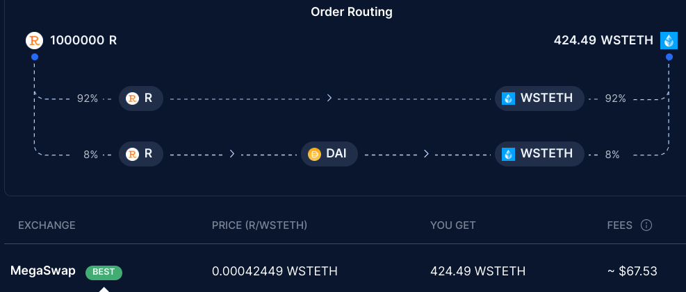

<table>
    <tr><th></th><th></th></tr>
    <tr>
        <td></td>
        <td> 
            <h1>Raft Finance</h1>
            <p>1. Changes To OneStepLeverage to support wrapped collateral token</br>
            2. Addition of OneInchV5BalancerAMM</br>
            3. Addition of ParaSwapBalancerAMM
            </p> 
            <p>Prepared by: curiousapple, Independent Security Researcher</p>
            <p>Duration: 1 day, July 7, 2023</p>
        </td>
    </tr>
</table>

# About 

### [Raft Finance](https://raft.fi/)
In their own words, "Raft is a governance-minimized, decentralized protocol that allows people to generate R (a USD stablecoin) by depositing capital-efficient collateral." </br>
Previously, we reviewed the addition of the wrapped token collateral type for Raft in [Raft-1](https://github.com/0xcuriousapple/curiousapple-audits/blob/fa510cc3771134845c8ffdfe4cb096d5742f10e6/src/Raft-1.md) , and the Raft Team has once again engaged us to review the changes they have made to `OneStepLeverage` to support the same wrapped collateral token. 
Additionally, this review includes addition of two new AMM routers: `OneInchV5BalancerAMM` and `ParaSwapBalancerAMM`.


### **curiousapple** 🦇

'curiousapple' is an independent smart contract security researcher. 
Previously, he served as a lead smart contract auditor at [Macro](https://0xmacro.com/) and is currently working independently.</br>
His auditing experience covers diverse set of protocols, including DeFi, Bridges, NFTs, DAOs, and Games, in all of which he has discovered severe bugs. </br>
You can find his previous work and contact [here](https://github.com/0xcuriousapple/curiousapple-audits/blob/231caa00d7f0ba8b016b4980b300e6a2fcd93815/README.md) </br>


# Summary & Scope

The scope of the audit included 
1. Changes made to OneStepLeverage contract by https://github.com/raft-fi/contracts/pull/430, https://github.com/raft-fi/contracts/pull/431</br>
2. `OneInchV5BalancerAMM` at commit [`75ca5cda2dcfc94e28cfb953205b847520270985`](https://github.com/raft-fi/contracts/tree/75ca5cda2dcfc94e28cfb953205b847520270985) 
3. `ParaSwapBalancerAMM` at commit [`75ca5cda2dcfc94e28cfb953205b847520270985`](https://github.com/raft-fi/contracts/tree/75ca5cda2dcfc94e28cfb953205b847520270985) 

# Summary of Findings

| ID     | Title                        | Status |
| ----------- | ---------------------------- | ----- |
| I-01 &nbsp;| `R-DAI-WstETH` route being optimal may not always hold true | NA |
| I-02 &nbsp;| `OneInchV5BalancerAMM` & `ParaSwapBalancerAMM` should never hold any funds | NA |
| I-03 &nbsp;| Ensure that no reentrancy is allowed for contracts being whitelisted for `depositForWithAccountCheck` | NA |

# Detailed Findings

## [I-01] `R-DAI-WstETH` route being optimal may not always hold true

The Raft Team has added `OneInchV5BalancerAMM` and `ParaSwapBalancerAMM`, enabling them to split the `R-WstETH` swap into two steps: one on the balancer `R-DAI` and one on `DAI-WstETH`. This manual division was necessary because aggregators failed to pick the `R-DAI` route from the Balancer pool for larger swaps. In this case, the Raft Team assumes the `R-DAI-WstETH` route is optimal in all cases. However, this assumption may not always remain true. For example, ParaSwap suggests MegaSwap's direct `R-WstETH` route for a swap of 1 million R. </br>


### Recommendation
Consider monitoring all liquidity resources to be sure of best optimal route.

## [I-02] `OneInchV5BalancerAMM` & `ParaSwapBalancerAMM` should never hold any funds

Both `OneInchV5BalancerAMM` and `ParaSwapBalancerAMM` allow anyone to withdraw the dormant funds from the contract using the balanceOf of the intermediary token.

```solidity
OneInchV5BalancerAMM.sol
L30

OneInchV5AMM._executeSwap(tokenIn, amountIn, intermediaryMinReturn, oneInchAMMData);
BalancerAMM._executeSwap(
                intermediaryToken, intermediaryToken.balanceOf(address(this)), minReturn, balancerAMMData
);
            
```

### Recommendation
I understand that these contracts are not designed to hold any funds. However, I would suggest you proceed with caution and make users aware that they are not expected to send their funds directly to this contract. This is because similar issues with routers have occurred in the past.</br>
For example:</br> 
https://twitter.com/hexagate_/status/1671188024607100928

## [I-03] Ensure that no reentrancy is allowed for contracts being whitelisted for `depositForWithAccountCheck`

This is not an issue for the OneStepLeverage contract, but in the future, if a new peripheral contract with possible reentrancy is added to the whitelist for `depositForWithAccountCheck`, someone could wrap more than the limit. This would be because the `balanceOf` the peripheral contract would have increased instead of the user's, allowing the user to wrap more if they reenter in middle.

# Disclaimer 

curiousapple's review is limited to identifying potential vulnerabilities in the code. It does not investigate security practices, operational security, or evaluate the code relative to a standard or specification.</br> 
curiousapple makes no warranties, either express or implied, regarding the code's merchantability, fitness for a particular purpose, or that it's free from defects.</br>
curiousapple will not be liable for any lost profits, business, contracts, revenue, goodwill, production, anticipated savings, loss of data, procurement costs of substitute goods or services, or any claim by any other party.</br> 
curiousapple will not be liable for any consequential, incidental, special, indirect, or exemplary damages, even if it has been advised of the possibility of such damages.</br>
This review does not constitute investment advice, is not an endorsement, and is not a guarantee as to the absolute security of the project.</br> 
By deploying or using the code, users agree to use the code at their own risk.</br>
curiousapple is not responsible for the content or operation of any third-party websites or software linked or referenced in the review, and shall have no liability for the use of such.</br>
